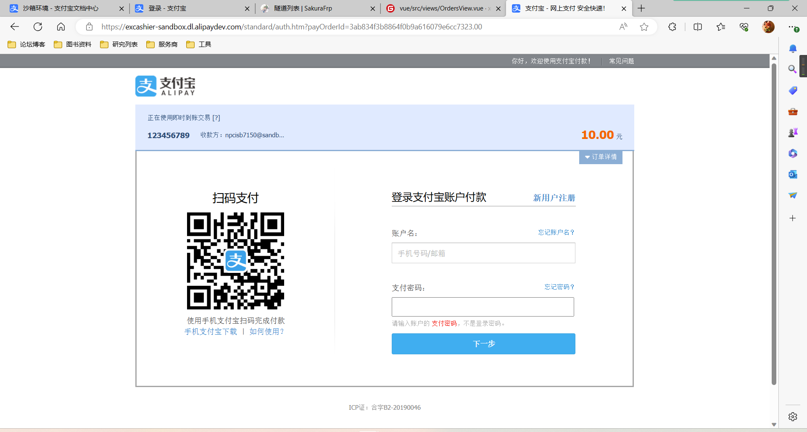

# AliPaySandBox-SpringBoot
### 支付宝沙箱集成SpringBoot示例

输入交易信息

支付界面

- 可以使用官方提供的支付宝沙箱环境的账号的app进行支付
- 使用了支付宝sdk的easy版本实现了跳转到支付宝进行支付
- 外部回调的post接口我是用的时候SakuraFrp进行端口映射，但是由于现在的政策原因，就支持https还是野证书，所以异步回调没有被成功调用

By：tyza66